# Домашнее задание Lifecycle

### Программа «Индекс массы тела»

Написать программу для расчета индекса массы тела и выдачи рекомендаций по ведению здорового образа жизни в плане организации питания.

Главный экран. 
1. Необходимо создать поля ввода значений: роста и веса.
2. Необходимо создать кнопку **«Рассчитать»**.

При нажатии на кнопку выполняется переход на второе активити, там выполняется расчет и определение индекса массы тела.

Второй экран.

1. Поле отображения индекса массы тела.

2. Картинка(`ImageView`) для визуализации человеческого телосложения в зависимости от значения индекса массы тела (полный, стройный, худенький). Данные файлы нужно скачать и сохранить в папке `drawable` для последующего импорта.

3. Текстовое поле информации, отображающее рекомендации по ведению здорового образа жизни и правильного питания в зависимости от значения индекса массы тела. В зависимости от объема выводимой информации оно может скроллится.
   
Приложение необходимо сохранить проектом в удаленном репозитории, для проверки качества предоставить ссылку преподавателю, либо сделать скрины эмулятора при каждом шаге работы приложения.

### Скриншоты домашнего задания

Скриншоты здесь

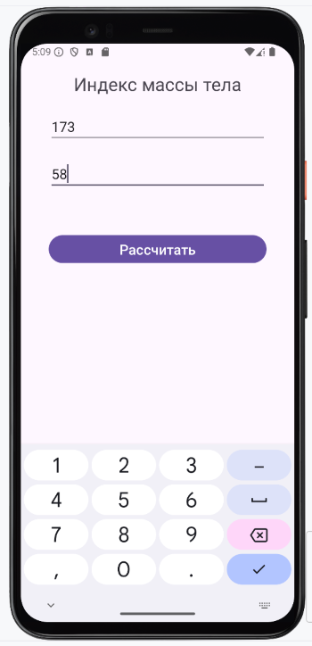
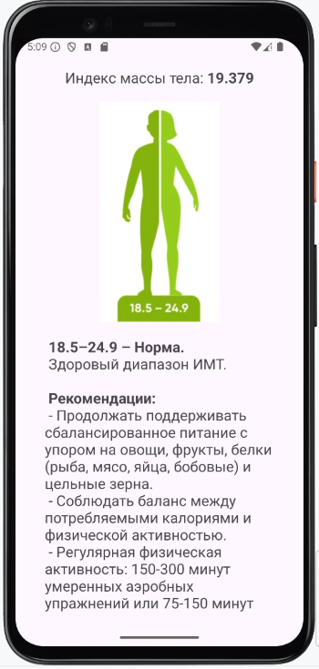
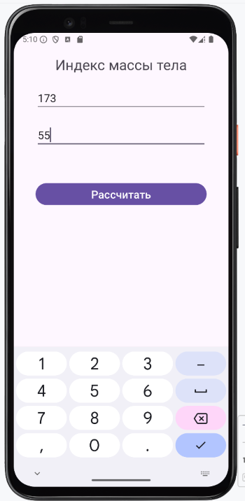
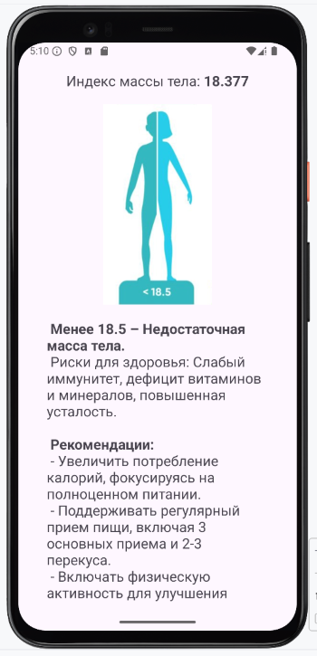
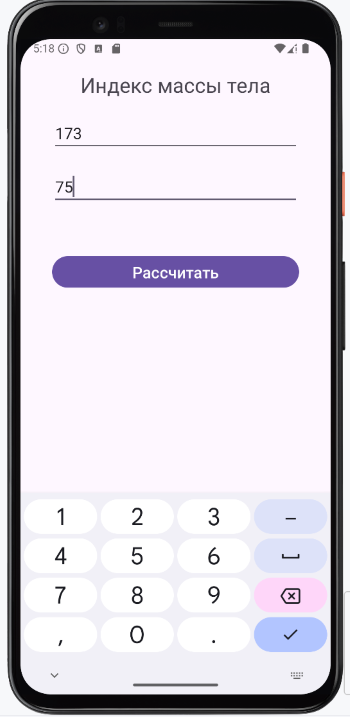
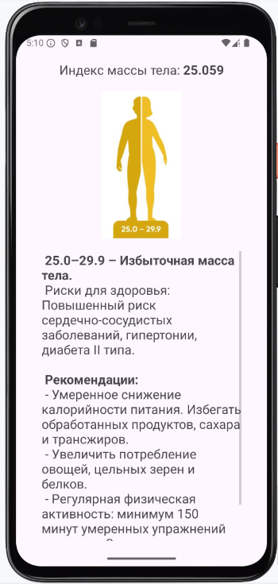
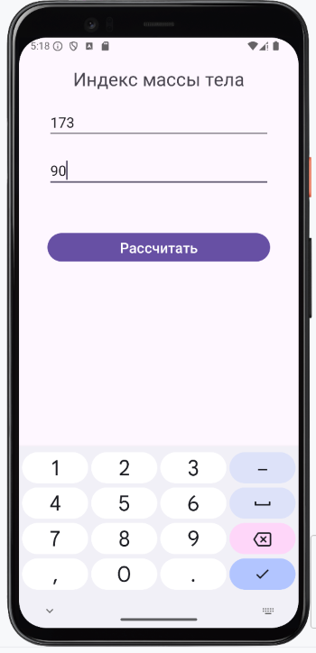
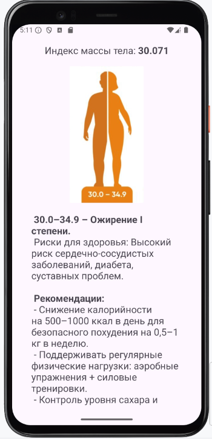
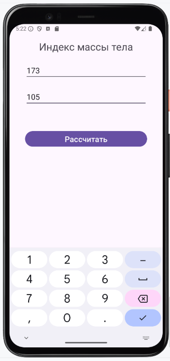
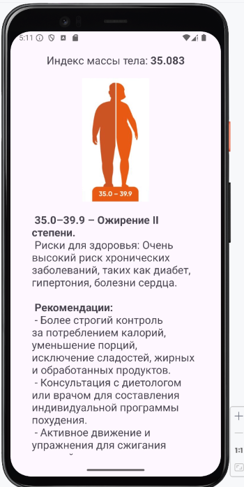
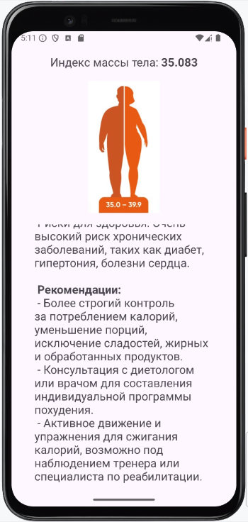
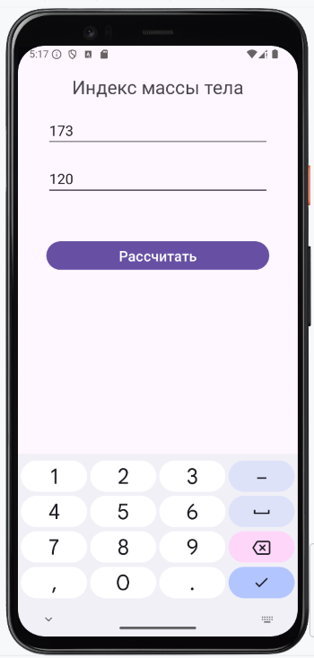
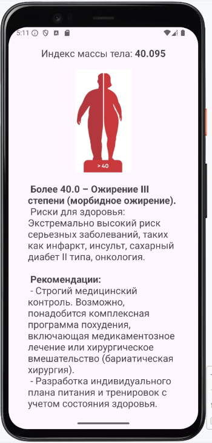
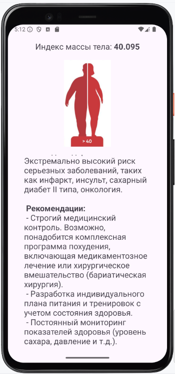

